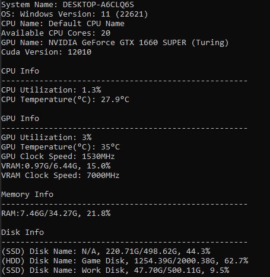

# Rhino (Rust Hardware Info)

This is just a super simple console app for viewing hardware utilization using sysinfo and nvml-wrapper (Only works on NVIDIA gpus). I made this project to try and learn some more rust so the implementation is pretty naive and slow but at least it works! FYI the sysinfo library doesn't have funciton to read the CPU name so...

### Demo

